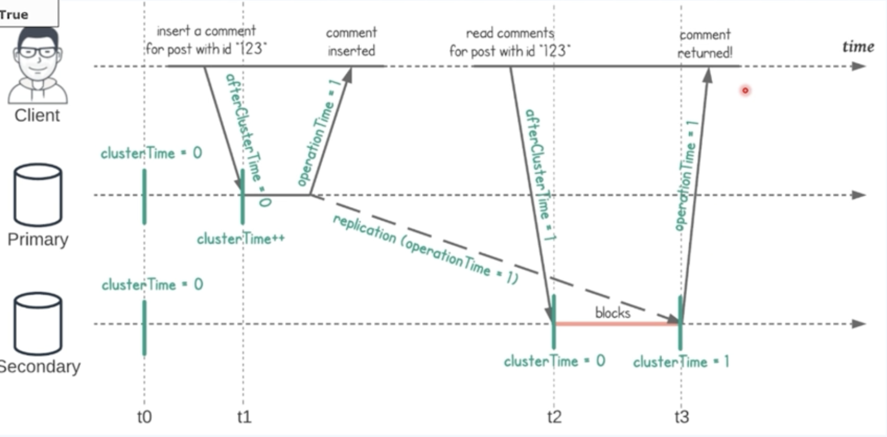

# Causal Consistency

ReadPreference 를 `secondary` 로 하였을 때 primary 에서 데이터를 추가하고 복제될 다른 곳에서 조회하려고 하면 데이터를 실시간으로 조회못하는 경우가 있다.

그래서 ReadConcern, WriteConcern 을 `majority` 로 설정하면 최신 데이터를 바로 조회는 할 수 있지만 그 사이에 수정된 데이터에 대해서는 제대로 조회못하는 경우가 있다.

일관성 있게 데이터를 유지하는 방법 중 하나로 ReadConcern, WriteConcern 을 `majority` 로 하고 ReadPreference 를 `secondary` 로 하였을 때 Causal Consistency 를 `True` 로 설정하면 해결할 수 있다.

---

위 이미지를 보면 primary 에서 새로운 데이터를 저장하고 secondary 로 복제하는 과정에서 cluster time 의 시간을 함께 보내게 되는데 그 사이에 조회하는 요청이 secondary 로 오게 되고 이 때 보낸 cluster time 이 secondary cluster time 보다 빠르면 복제를 따라갈 때 까지 Blocking 을 하고 시간을 대기했다가 진행하기 때문에 정상적으로 조회가 된다.