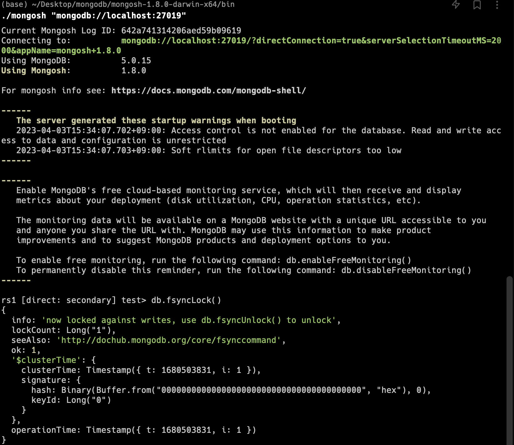
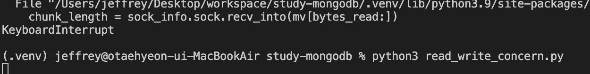
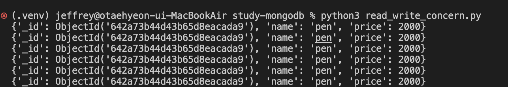
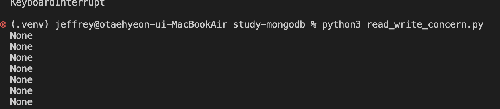

# fsyncLock 을 통한 Read, Write 확인

`27019` 포트에 mongosh 로 접근하여 `fsyncLock` 잠금 처리를 한다



하지만 아직 까지는 `27018` 에 복제를 진행 중이기 때문에 읽고 쓰는 것에는 문제가 없다.

---

`27018` 포트에 mongosh 로 접근하여 `fsyncLock` 추가 잠금 처리를 한다



2개를 잠금처리 하였더니 primary 인 `27017` 에는 `insert` 가 정상적으로 되었어도
Write 복제가 이루어 지지 않았기 때문에 대기상태로 진입한 것으로 확인 할 수 있다.

---

총 3개의 Replica Set 상태에서 2개가 잠금이 되어도 Write 성공 조건이 1개이기만 하면 된다라고 조건을 주려면 다음 처럼 옵션을 추가하면 된다.

```
with_options(write_concern=WriteConcern(w=1))
```

다시 실행해보면 정상적으로 조회하는 것을 볼 수 있다.



---

조회 할 때 `linearizable` 옵션을 줬을 경우 최신 데이터를 읽으려고 하기 때문에 

```
with_options(read_concern=ReadConcern('linearizable'))
```

아직 `majority` 가 진행 중인 것으로 확인되어 조회하려고 보면 조회가 되지 않는다.

---

다시 ReadConcern 옵션을 `majority`로 수정하고 데이터를 수정해보자.

```
with_options(read_concern=ReadConcern('majority'))
```

```
db.sales.with_options(write_concern=WriteConcern(w=1)).insert_many([
    {
        "name" : "pencil",
        "price" : 10000 <- 가격 수정
    },
    {
        "name" : "paper",
        "price" : 100
    },
    {
        "name" : "pen",
        "price" : 2000
    }
])

query_filter = {"price" : { "$gt" : 3000 }} <- 조회할 가격 수정
```

다시 실행해 보면 None 으로 값이 나온다.



이는 WriteConcern 옵션의 `w=1` 인 상태에 `27017` primary 에는 적용되었지만 나머지 secondary 들은 적용이 안된 상태에서 `majority` 로 읽어 오려고 하니 특정 시점에서는 읽어오려고 하지만 조회 조건의 `price > 3000` 의 데이터는 적용되어 있지 않기 때문에 결과를 못가져올 수도 있다.

`27019` 포트의 락을 풀고 WriteConcern 옵션을 `majority` 로 주면 2개는 복제가 가능하기 때문에 데이터를 조회해온다.

다시 with 옵션을 모두 지우고 url 옵션으로 `w=3` 를 주고 파일을 실행해보면 대기 상태에 들어간 것을 확인할 수 있다.

왜냐하면 `27017`과 `27018` 에 대해서는 복제가 이루어 지고 있지만 3개를 충족하지 못하기 때문이다.

다시 `w=majority` 로 변경하고 실행하면 정상적으로 조회하는 것을 볼 수 있다.

`readConcernLevel=linearizable` 옵션을 추가하여 조회해도 잘 가져오는 것을 볼 수 있다.
